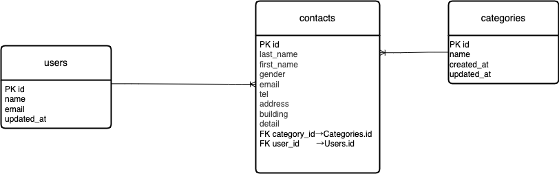

# お問い合わせ管理システム(laravel)
ユーザーがお問い合わせを送信し、管理者が一覧・検索・詳細・編集・削除・CSV 出力を行える
シンプルなお問い合わせ管理システムです。
認証は Laravel Fortify を使用し、UI パーツを使わず HTML/CSS/Blade で構築しています。

## Dockerビルド

 git clone git@github.com:s36-cell/test_contact_form.git
 cd test_contact_form
 ```bash
 docker compose up -d --build
 ```


## laravel環境構築
```bash
 ・docker-compose exec app composer install
 ・cp .env.example .env
    .env ファイルを以下のように編集してください。
    DB_CONNECTION=mysql
    DB_HOST=db
    DB_PORT=3306
    DB_DATABASE=test_contact_form
    DB_USERNAME=laravel
    DB_PASSWORD=laravel
 ・docker compose exec app php artisan key:generate
 ・cp .env.example .env
 ・php artisan migrate:fresh --seed
```

## 開発環境
```bash
 ・お問い合わせ画面：http://localhost:8000
 ・確認画面：POST/confirm(フォームから遷移)
 ・完了画面：POST/thanks(確認画面から遷移)
 ・ログイン：http://localhost:8000/login
 ・新規登録：http://localhost:8000/register
 ・管理一覧：http://localhost:8000/admin
   (ログイン後にアクセス可能)
 ・phpMyAdmin：http://localhost:8080
```

## 使用技術
```bash
 ・PHP：8.3.27（Docker app コンテナ内）
 ・Laravel：8.75
 ・MySQL 8.0.44
 ・Nginx 1.27.x(latest)
 ・Docker Desktop / Docker Compose
 ・認証：Laravel  Fortify
 ・フロントエンド：HTML / CSS / Blade
```

## ER図
 

